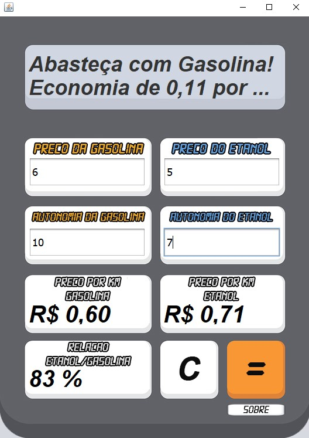
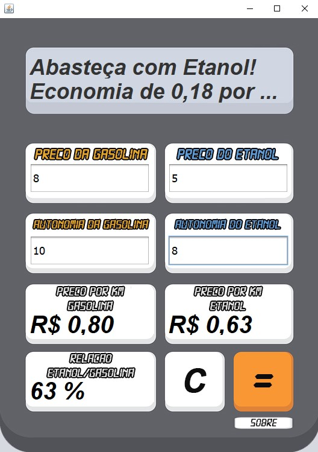
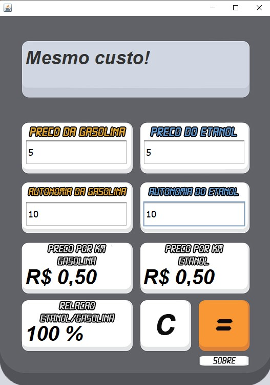

<h1 align="center">
    Calculadora de Combustível
</h1>

## 💻 Sobre o projeto

Programa desenvolvido em Java para cálculo da relação de preço entre a gasolina e o etanol.

---

## ⚙️ Funcionalidades

- Realiza o calculo da relação custo gasolina/etanol;
- Mostra o preço por KM da gasolina e do etanol;
- Interface intuitiva.

---

## 📷 Imagens do projeto

  
  
  

---

## 🚀 Como executar o projeto

Executar o aplicativo Clock Unlocker (Requer Google Chrome / Chromedriver atualizados na mesma versão).

---

## 🛠 Tecnologias utilizadas

Foram utilizadas as seguintes ferramentas: Java.

---

## 👨‍💻 Autor
 
 <b>Lucas William Martins Lima</b>
  
 
---
